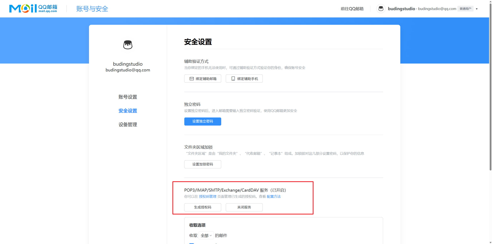

# 配置注册邮箱验证

启用注册邮箱验证需要同时配置 Redis 和 SMTP：Redis 用于保存验证码、注册凭证、频率限制计数和邮件队列任务，SMTP 用于发送验证码邮件。

:::warning
请勿将邮箱授权码、Redis 密码或其他真实凭据提交到代码仓库。生产环境中的 Redis 不应直接暴露在公网。
:::

## 获取邮箱授权码

以 QQ 邮箱为例，进入账号设置中的安全设置，开启 SMTP 服务并生成授权码。不同邮箱服务商的入口可能不同，请以服务商当前提供的说明为准。



授权码仅在 SMTP 身份验证时使用，应填写到 `SMTP_PASSWORD`，不要填写邮箱登录密码。

## 生成验证码密钥

生成一段独立的随机密钥，用于保护验证码和注册凭证：

```bash
openssl rand -hex 32
```

请妥善保存输出的 64 位十六进制字符串，稍后将其填写到 `EMAIL_CODE_SECRET`。不要与 `JWT_SECRET`、数据库密码或 Redis 密码共用。

## 配置 SMTP

在 `backend/.env` 中填写 SMTP 配置。以下为 QQ 邮箱示例：

```dotenv
SMTP_HOST=smtp.qq.com
SMTP_PORT=465
SMTP_USERNAME=your-account@qq.com
SMTP_PASSWORD=CHANGE_ME_TO_YOUR_AUTHORIZATION_CODE
SMTP_FROM_ADDRESS=your-account@qq.com
SMTP_FROM_NAME=布丁简历
SMTP_TLS_MODE=tls
```

- `SMTP_USERNAME` 通常填写完整邮箱地址；
- `SMTP_PASSWORD` 填写邮箱服务商生成的授权码；
- 端口 `465` 通常对应 `tls`，端口 `587` 通常对应 `starttls`；
- 生产环境必须使用 `tls` 或 `starttls`，不能设置为 `none`。

## 配置 Redis

如果 Redis 与后端部署在同一台服务器，可参考以下配置：

```dotenv
REDIS_ADDR=127.0.0.1:6379
REDIS_USERNAME=
REDIS_PASSWORD=CHANGE_ME_TO_YOUR_REDIS_PASSWORD
REDIS_DB=0
REDIS_TLS_ENABLED=false
REDIS_TLS_SERVER_NAME=
REDIS_KEY_PREFIX=pudding:production
```

使用托管 Redis 或跨主机连接时，请优先通过内网访问；必须跨公网连接时，应启用 TLS、配置 `REDIS_TLS_SERVER_NAME`，并通过防火墙或安全组限制来源地址。

## 启用邮箱验证

完成 SMTP 和 Redis 配置后，将生成的随机密钥填入 `.env`，再启用邮箱验证：

```dotenv
EMAIL_CODE_SECRET=CHANGE_ME_TO_THE_GENERATED_RANDOM_SECRET
EMAIL_CODE_TTL=5m
REGISTRATION_TICKET_TTL=10m
EMAIL_CODE_COOLDOWN=60s
EMAIL_CODE_MAX_ATTEMPTS=5
EMAIL_CODE_MAX_PER_EMAIL_HOUR=5
EMAIL_CODE_MAX_PER_IP_HOUR=20

REGISTRATION_EMAIL_CODE_ENABLED=true
```

`EMAIL_CODE_SECRET` 必须是至少 32 个字符的随机字符串。其余参数分别控制验证码有效期、注册凭证有效期、发送冷却时间及频率限制，可根据实际业务量调整。

## 重启并验证

如果后端通过 systemd 运行，请重启服务并查看日志：

```bash
sudo systemctl restart pudding-resume
sudo journalctl -u pudding-resume -n 100 --no-pager
```

后端启动时会检查邮箱验证所需的 Redis、SMTP 和密钥配置。配置无效或 Redis 连接失败时，服务将终止启动，并在日志中给出具体原因。服务正常启动后，可通过注册页面发送验证码，确认邮件能够正常送达。
